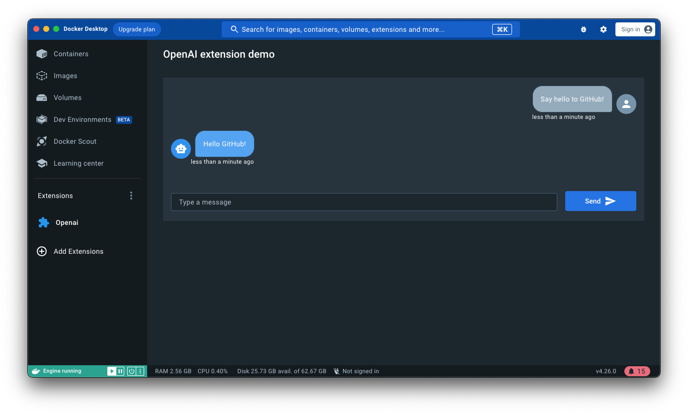

# ChatGPT Docker Extension

This extension was created for the [Docker AI/ML Hackathon](https://docker.devpost.com/details/workshops) in October 2023. It is a simple extension that allows you to chat with GPT-3 from the Docker Desktop Dashboard.

You can see the whole live stream of the development of this extension [here](https://www.youtube.com/watch?v=78IMA8xEBHA).
This extension is composed of:

- A [frontend](./ui) app in React that has a chat UI. Every time you send a message, it will be sent to the backend and both your message and the response from ChatGPT will be displayed in the chat.
- A [backend](./backend) container that runs an API in NodeJS. This API is responsible for sending the messages to ChatGPT and returning the response to the frontend.
- A Mongo database that stores the conversation history.

### Screenshots



> You can build your Docker Extension using your fav tech stack:
>
> - Frontend: React, Angular, Vue, Svelte, etc.
>   Basically, any frontend framework you can bundle in an `index.html` file with CSS, and JS assets.
> - Backend (optional): anything that can run in a container.

<details>
  <summary>Looking for more templates?</summary>

1. [React + NodeJS](https://github.com/benja-M-1/node-backend-extension).
2. [React + .NET 6 WebAPI](https://github.com/felipecruz91/dotnet-api-docker-extension).

Request one or submit yours [here](https://github.com/docker/extensions-sdk/issues).

</details>

## Local development

You can use `docker` to build, install and push your extension. Also, we provide an opinionated [Makefile](Makefile) that could be convenient for you. There isn't a strong preference of using one over the other, so just use the one you're most comfortable with.

### Prerequisites

The extension contains a `docker-compose.yaml` where you can see it loads an env file from a folder.

- Change the folder according to your needs. You can reference it to the `.env` file that is inside this repository.
- Change the `OPENAI_API_KEY` to your own API key. You can get one [here](https://platform.openai.com/).

### Build and install

To build the extension, use `make build-extension` **or**:

```shell
  docker buildx build -t lucasbernalte981/chatgpt-docker-extension:latest . --load
```

To install the extension, use `make install-extension` **or**:

```shell
  docker extension install lucasbernalte981/chatgpt-docker-extension:latest
```

> If you want to automate this command, use the `-f` or `--force` flag to accept the warning message.

To preview the extension in Docker Desktop, open Docker Dashboard once the installation is complete. The left-hand menu displays a new tab with the name of your extension. You can also use `docker extension ls` to see that the extension has been installed successfully.

### Frontend development

During the development of the frontend part, it's helpful to use hot reloading to test your changes without rebuilding your entire extension. To do this, you can configure Docker Desktop to load your UI from a development server.
Assuming your app runs on the default port, start your UI app and then run:

```shell
  cd ui
  npm install
  npm run dev
```

This starts a development server that listens on port `3000`.

You can now tell Docker Desktop to use this as the frontend source. In another terminal run:

```shell
  docker extension dev ui-source lucasbernalte981/chatgpt-docker-extension:latest http://localhost:3000
```

In order to open the Chrome Dev Tools for your extension when you click on the extension tab, run:

```shell
  docker extension dev debug lucasbernalte981/chatgpt-docker-extension:latest
```

Each subsequent click on the extension tab will also open Chrome Dev Tools. To stop this behaviour, run:

```shell
  docker extension dev reset lucasbernalte981/chatgpt-docker-extension:latest
```

### Backend development (optional)

This example defines an API in Go that is deployed as a backend container when the extension is installed. This backend could be implemented in any language, as it runs inside a container. The extension frameworks provides connectivity from the extension UI to a socket that the backend has to connect to on the server side.

Note that an extension doesn't necessarily need a backend container, but in this example we include one for teaching purposes.

Whenever you make changes in the [backend](./backend) source code, you will need to compile them and re-deploy a new version of your backend container.
Use the `docker extension update` command to remove and re-install the extension automatically:

```shell
docker extension update lucasbernalte981/chatgpt-docker-extension:latest
```

> If you want to automate this command, use the `-f` or `--force` flag to accept the warning message.

> Extension containers are hidden from the Docker Dashboard by default. You can change this in Settings > Extensions > Show Docker Extensions system containers.

### Clean up

To remove the extension:

```shell
docker extension rm lucasbernalte981/chatgpt-docker-extension:latest
```

## What's next?

- To learn more about how to build your extension refer to the Extension SDK docs at https://docs.docker.com/desktop/extensions-sdk/.
- To publish your extension in the Marketplace visit https://www.docker.com/products/extensions/submissions/.
- To report issues and feedback visit https://github.com/docker/extensions-sdk/issues.
- To look for other ideas of new extensions, or propose new ideas of extensions you would like to see, visit https://github.com/docker/extension-ideas/discussions.
